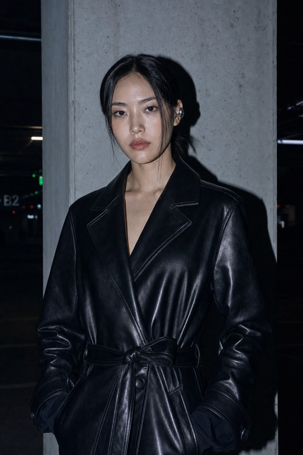
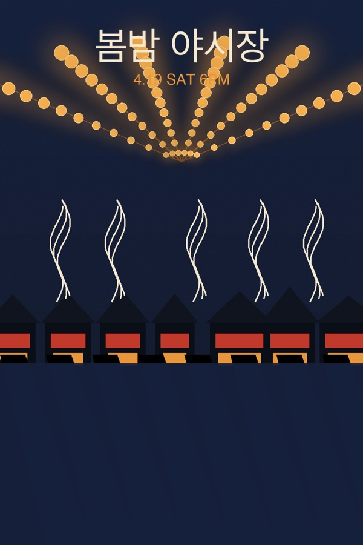

# Examples — 실측 캘리브레이션 3컷 (2026-07)

이 스킬의 이미지 컴파일 계층 규칙만으로 컴파일한 프롬프트와 실제 생성 결과다. 각 프롬프트는 `scripts/check_prompt.mjs` 검증 통과(ok:true) 후 생성했다. 원본 해상도 대신 축소 JPEG를 커밋한다.

| 예시 | 검증한 규칙 | 프롬프트 | 결과 | 판정 |
|---|---|---|---|---|
| 플래시 화보 | Format B 슬롯 순서, direct flash 조명 시그니처, 포즈 토큰(subtle contrapposto·relaxed neutral hips), 레더 소재×빛(hard speculars) — `image/editorial-fashion.md` | [flash-editorial.prompt.txt](flash-editorial.prompt.txt) |  | 명중 — sharp drop shadow·정면광·speculars·이어커프까지 전부 |
| 한글 포스터 | C3 카테고리, Format A 6섹션, 롤 라벨+Tier-1 결합 공식, HEX 4색 — `image/categories.md`·`image/typography.md` | [korean-poster.prompt.txt](korean-poster.prompt.txt) |  | 헤드라인 "봄밤 야시장" 정확 렌더. 서브헤드가 장면 요소와 겹침 → 클리어존 규칙이 이 실측에서 추가됨 |
| 창가 니트 | 자연광 조명 시그니처, 니트 소재×빛(matte 흡수+어깨 하이라이트), soft shadow edges — `image/editorial-fashion.md` | [knit-daylight.prompt.txt](knit-daylight.prompt.txt) |  | 명중. 시선 방향 모호("왼쪽") → 뷰어 기준 토큰 규칙이 이 실측에서 추가됨 |

부분 실패 2건은 은폐하지 않고 규칙으로 환원했다 — `image/typography.md` 클리어존 규칙, `image/editorial-fashion.md` 방향 기준 규칙(둘 다 2026-07 실측 스탬프). 이 폴더는 회귀 기준이기도 하다: 컴파일 규칙을 바꾸면 같은 요청 3개를 다시 컴파일해 검증기 통과와 결과 품질을 대조한다.
